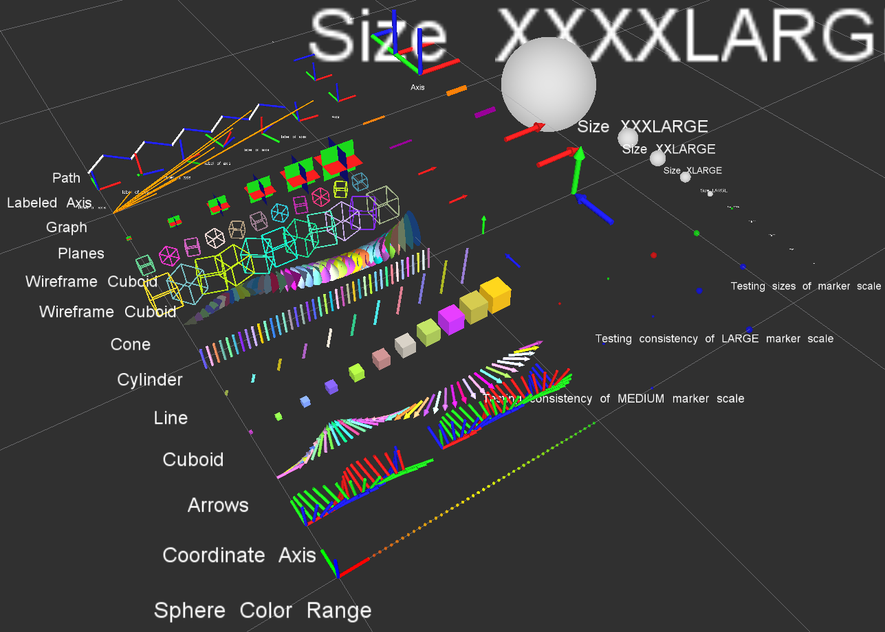
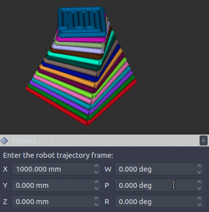

# Rviz Visual Tools

C++ API wrapper for displaying shapes and meshes in Rviz via helper functions that publish markers. Useful for displaying and debugging data. For more advanced robot visualization features, see the [moveit_visual_tools](https://github.com/davetcoleman/moveit_visual_tools) which builds on this class.

This package includes:

 - Rviz Panel GUI to step through your code for debugging and testing
 - Rviz-based keyboard control for stepping through application
 - Easy to use helper functions for visualizing in Rviz fast
 - Basic geometric markers for Rviz
 - More complex geometric shapes such as coordinate frames, framed boxes, planes, paths, graphs
 - Ability to quickly choose standard colors and sizes
 - Tools to ensure proper connection to Rviz before publishing visualizations
 - Shortcuts to convert between different types of points and poses - ROS msgs, Eigen, tf, etc
 - Batch publishing capabilities to reduce over throttling ROS messages
 - A tf publishing helper class
 - An interactive marker helper class

Developed by [Dave Coleman](http://dav.ee) at the Correll Robotics Lab, University of Colorado Boulder with help from Andy McEvoy and many others.

<a href='https://ko-fi.com/A7182AMW' target='_blank'></a>

 * [](https://travis-ci.org/PickNikRobotics/rviz_visual_tools) Travis CI
 * [](http://build.ros.org/view/Kbin_uX64/job/Kbin_uX64__rviz_visual_tools__ubuntu_xenial_amd64__binary/) ROS Kinetic Buildfarm - AMD64 Xenial Debian Build for Ubuntu 16.04
 * [](http://build.ros.org/view/Kdev/job/Kdev__rviz_visual_tools__ubuntu_xenial_amd64/) ROS Kinetic Buildfarm - AMD64 Xenial Devel Build for Ubuntu 16.04
 * [](http://build.ros.org/job/Msrc_uB__rviz_visual_tools__ubuntu_bionic__source/) ROS Melodic Buildfarm - AMD64 Bionic Debian Build for Ubuntu 18.04
 * [](http://build.ros.org/job/Mdev__rviz_visual_tools__ubuntu_bionic_amd64/) ROS Melodic Buildfarm - AMD64 Bionic Devel Build for Ubuntu 18.04




## Install

### Ubuntu Debian

```
sudo apt-get install ros-melodic-rviz-visual-tools
```

### Build from Source

Clone this repository into a catkin workspace, then use the rosdep install tool to automatically download its dependencies. Depending on your current version of ROS, use:
```
rosdep install --from-paths src --ignore-src --rosdistro melodic
```

## Quick Start Demo

To see random shapes generated in Rviz, first launch Rviz:

    roslaunch rviz_visual_tools demo_rviz.launch

Then start demo:

    roslaunch rviz_visual_tools demo.launch

## Code API

See [the Doxygen documentation](http://docs.ros.org/melodic/api/rviz_visual_tools/html/annotated.html)

## Usage

We'll assume you will be using these helper functions within a class. Almost all of the functions assume you are publishing transforms in the world frame (whatever you call that e.g. /odom).

### Initialize

Add to your includes:
```
#include <rviz_visual_tools/rviz_visual_tools.h>
```

Add to your class's member variables:
```
// For visualizing things in rviz
rviz_visual_tools::RvizVisualToolsPtr visual_tools_;
```

In your class' constructor add:
```
visual_tools_.reset(new rviz_visual_tools::RvizVisualTools("base_frame","/rviz_visual_markers"));
```

Change the first parameter to the name of your robot's base frame, and the second parameter to whatever name you'd like to use for the corresponding Rviz marker ROS topic.

### Tools

Now in your code you can easily debug your code using visual markers in Rviz

Start rviz and create a new marker using the 'Add' button at the bottom right. Choose the marker topic to be the same as the topic you specified in the constructor.

### Example Code

In the following snippet we create a pose at xyz (0.1, 0.1, 0.1) and rotate the pose down 45 degrees along the Y axis. Then we publish the pose as a arrow for visualziation in Rviz. Make sure your Rviz fixed frame is the same as the one chosen in the code.

    // Create pose
    Eigen::Affine3d pose;
    pose = Eigen::AngleAxisd(M_PI/4, Eigen::Vector3d::UnitY()); // rotate along X axis by 45 degrees
    pose.translation() = Eigen::Vector3d( 0.1, 0.1, 0.1 ); // translate x,y,z

    // Publish arrow vector of pose
    ROS_INFO_STREAM_NAMED("test","Publishing Arrow");
    visual_tools_->publishArrow(pose, rviz_visual_tools::RED, rviz_visual_tools::LARGE);

    // Don't forget to trigger the publisher!
    visual_tools_->trigger();

## Rviz GUI Usage

Publishes on the topic of ``/rviz_visual_tools_gui``

The buttons in the [Joy](http://docs.ros.org/api/sensor_msgs/html/msg/Joy.html) message correspond to the following:

```
1 - Next
2 - Continue
3 - Break
4 - Stop
```

Note: only Next is fully implemented

### Mouse-Based Control


Use the Rviz panel called "RvizVisualToolsGui" to step through your program.

### Keyboard-Based Control


Switch to the "KeyTool" in the top of the Rviz window and use the following keyboard commands:
 - n: next
 - c or a: continue
 - b: break
 - s: stop

## API

### Basic Publishing Functions

See ``rviz_visual_tools.h`` for more details and documentation on the following functions:

 - publishSphere
 - publishSpheres
 - publishArrow/publishXArrow
 - publishYArrow
 - publishZArrow
 - publishCuboid
 - publishCone
 - publishXYPlane
 - publishXZPlane
 - publishYZPlane
 - publishLine
 - publishPath
 - publishPolygon
 - publishBlock
 - publishWireframeCuboid
 - publishWireframeRectangle
 - publishAxis
 - publishAxisLabeled
 - publishCylinder
 - publishMesh
 - publishMesh
 - publishText
 - publishTest

And more...

### Helper Functions

Reset function

 - ``deleteAllMarkers()`` - tells Rviz to clear out all current markers from being displayed.

All markers must be triggered after being published, by calling the ``trigger()`` function. This allows batch publishing to be achieved by only calling after several markers have been created, greatly increasing the speed of your application. You can even explicitly tell ``rviz_visual_tools`` how often to publish via the ``triggerEvery(NUM_MARKERS)`` command:

 - trigger()
 - triggerEvery(20)

Conversion functions

 - convertPose
 - convertPoint32ToPose
 - convertPoseToPoint
 - convertPoint
 - convertPoint32
 - convertFromXYZRPY
 - convertToXYZRPY

Convenience functions

 - generateRandomPose
 - generateEmptyPose
 - dRand
 - fRand
 - iRand
 - getCenterPoint
 - getVectorBetweenPoints

Frame locking



This allows the markers to be automatically updated as the base frame moves without having to republish. You can enable it via ``enableFrameLocking()`` (this is not enabled by default).

### Available Colors

This package helps you quickly choose colors - feel free to send PRs with more colors as needed

    BLACK,
	BLUE,
    BROWN,
    CYAN,
    DARK_GREY,
    GREEN,
    GREY,
    LIME_GREEN,
    MAGENTA,
    ORANGE,
    PINK,
    PURPLE,
    RED,
    WHITE,
    YELLOW,
    TRANSLUCENT_LIGHT,
    TRANSLUCENT,
    TRANSLUCENT_DARK,
    RAND,
	CLEAR,
    DEFAULT // i.e. 'do not change default color'

### Available Marker Sizes

    XXXXSMALL,
    XXXSMALL,
    XXSMALL,
    XSMALL,
    SMALL,
    MEDIUM,
    LARGE,
    XLARGE,
    XXLARGE,
    XXXLARGE,
    XXXXLARGE,

## Interactive Marker Helper Class

This class quickly gives you basic 6dof pose interactive marker funcitonality. A demo is available:

    roslaunch rviz_visual_tools demo_rviz.launch
    rosrun rviz_visual_tools imarker_simple_demo

## TF Visual Tools

This tool lets you easily debug Eigen transforms in Rviz. Demo use:

    rviz_visual_tools::TFVisualTools tf_visualizer;
    Eigen::Affine3d world_to_shelf_transform = Eigen::Affine3d::Identity(); // or whatever value
    tf_visualizer.publishTransform(world_to_shelf_transform, "world", "shelf");

*Note: this is a work in progress*

## Testing and Linting

To run [roslint](http://wiki.ros.org/roslint), use the following command with [catkin-tools](https://catkin-tools.readthedocs.org/):

    catkin build --no-status --no-deps --this --make-args roslint

To run [catkin lint](https://pypi.python.org/pypi/catkin_lint), use the following command with [catkin-tools](https://catkin-tools.readthedocs.org/):

    catkin lint -W2

Use the following command with [catkin-tools](https://catkin-tools.readthedocs.org/) to run the small amount of available tests:

    catkin run_tests --no-deps --this -i

Run with clang-tidy:

    run-clang-tidy-4.0.py -clang-tidy-binary=/usr/lib/llvm-4.0/bin/clang-tidy -fix -p=/home/dave/ros/current/ws_moveit/build/rviz_visual_tools .

## Docker Image

[Dockerhub](https://hub.docker.com/r/davetcoleman/rviz_visual_tools/builds/) automatically creates a Docker for this repo. To run with GUI:

    # This is not the safest way however, as you then compromise the access control to X server on your host
    xhost +local:root # for the lazy and reckless
    docker run -it --env="DISPLAY" --env="QT_X11_NO_MITSHM=1" --volume="/tmp/.X11-unix:/tmp/.X11-unix:rw" davetcoleman/rviz_visual_tools:melodic
    export containerId=$(docker ps -l -q)
    # Close security hole:
    xhost -local:root

(Optional) To build the docker image locally for this repo, run in base of package:

    docker build -t davetcoleman/rviz_visual_tools:melodic .

## Contribute

Please send PRs for new helper functions, fixes, etc!
